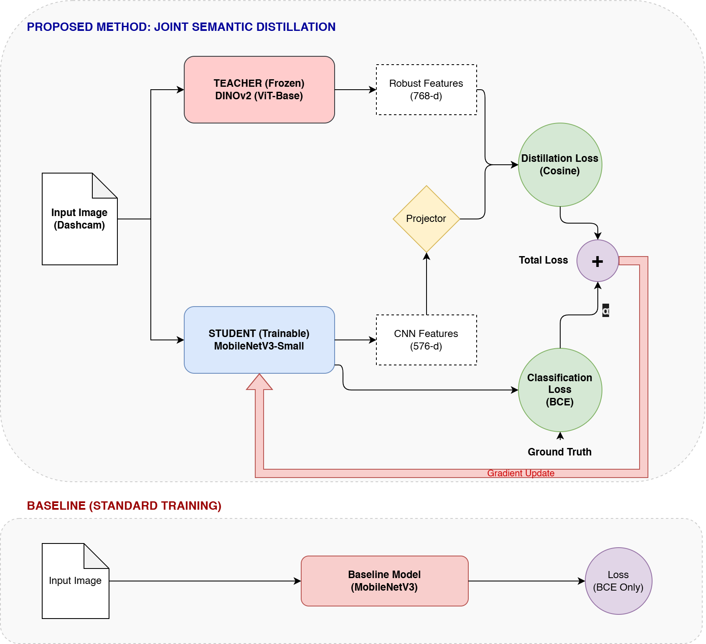
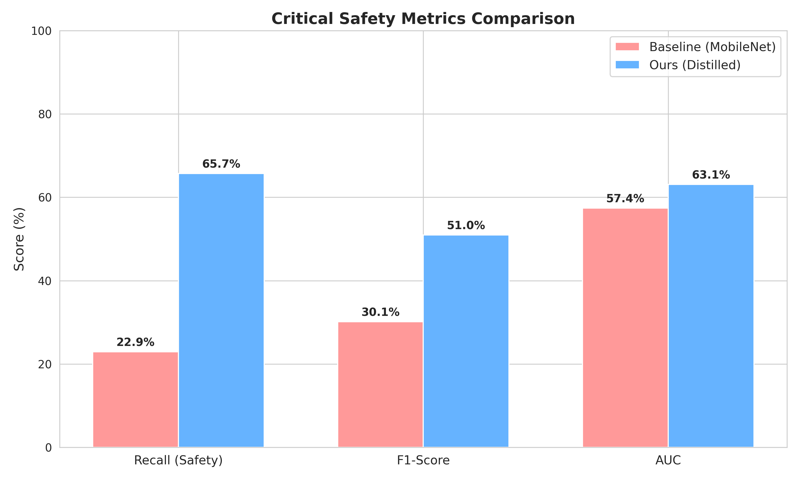
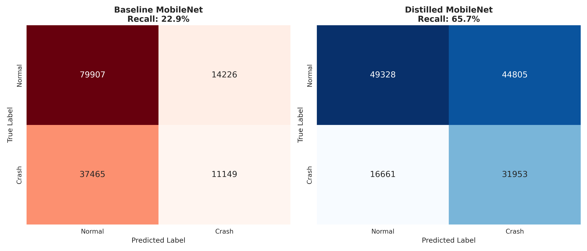
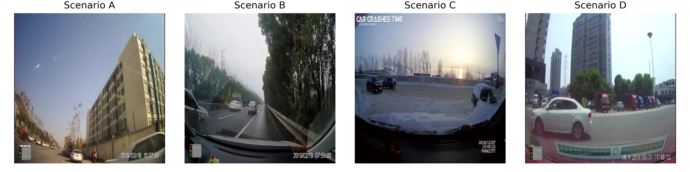

# Real-Time Traffic Accident Detection via Joint Semantic Distillation

[](https://opensource.org/licenses/MIT)
[](https://pytorch.org/)
[](https://gradio.app/)

## 🚀 Overview

Traffic accident detection in autonomous systems requires a delicate balance between **real-time performance** and **safety-critical sensitivity**. We propose a **Joint Semantic Distillation (JSD)** framework that transfers robust *world knowledge* from a frozen **DINOv2 (ViT-Base)** teacher to a lightweight **MobileNetV3-Small** student.

By jointly optimizing:
- **Binary classification loss** ($L_{BCE}$)
- **Semantic feature alignment loss** ($L_{Cos}$)

the distilled model achieves **high-recall accident detection on edge devices**, running at **>100 FPS** with a **3× Recall improvement** over standard training.



---

## 📊 Results

We evaluated the method on the **DoTA (Detection of Traffic Anomaly)** dataset (142k test frames).

### Quantitative Metrics
The distilled student fundamentally shifts the decision boundary to prioritize safety, achieving a massive gain in Recall (Sensitivity).

| Model | Accuracy | Recall | F1-Score | AUC | 
|-------|----------|--------|----------|-----|
| MobileNetV3 (Baseline) | **63.8%** | 22.9% | 0.301 | 0.574 |
| **Ours (Distilled)** | 56.9% | **65.7%** | **0.510** | **0.631** |



### Confusion Matrix Analysis
As shown below, the Baseline (Left) is biased towards predicting "Normal," missing most accidents. Our Distilled Model (Right) correctly identifies the majority of crash events.



### Qualitative Success Cases
The distilled model successfully detects accidents in challenging scenarios (blur, occlusion) where the baseline fails.


## 📂 Dataset

We utilize the DoTA dataset. As seen in the samples below, the data presents significant challenges including motion blur, night-time driving, and rapid collision dynamics, which necessitates the use of Foundation Model features.



---

## 🛠️ Installation

### 1. Clone the repository
```bash
git clone https://github.com/Alpsource/Semantic-Anomaly-Distillation.git
cd Semantic-Anomaly-Distillation
```

### 2. Install dependencies
```bash
pip install -r requirements.txt
```

---

## 🏃 Usage

### 1️⃣ Data Preparation

Download the **DoTA Dataset** and place the extracted videos or frames inside the `data/` directory.

Pre-compute and cache DINOv2 teacher features (≈ **5× faster training**):

```bash
python precompute_teacher.py
```

---

### 2️⃣ Training

Train the **distilled student (our method)**:

```bash
python train_distillation.py
```

(Optional) Train the **baseline model** for comparison:

```bash
python train_baseline.py
```

---

### 3️⃣ Evaluation

Compute **Recall, F1-Score, and AUC** on the test set:

```bash
python evaluate_comparison.py
```

---

### 4️⃣ Visualization

Generate *Success vs. Failure* grids highlighting cases where distillation helps:

```bash
python visualize_success.py
```

---

### 5️⃣ Interactive Demo

Launch the **Gradio** interface for real-time video inference:

```bash
python app.py
```

---

## 📂 Project Structure

```plaintext
.
├── checkpoints/              # Saved model weights
├── data/                     # Dataset storage
├── assets/                   # Images for README/Paper
├── src/                      # Core model & dataset logic
│   ├── dataset.py
│   ├── models/
│   └── utils/
├── train_distillation.py     # Main training script (JSD)
├── train_baseline.py         # Baseline training script
├── evaluate_comparison.py    # Metrics calculation
├── precompute_teacher.py     # DINOv2 feature extraction
├── visualize_success.py      # Qualitative analysis
├── app.py                    # Gradio demo interface
└── requirements.txt          # Python dependencies
```

---

## 📄 License

This project is licensed under the **MIT License**.
